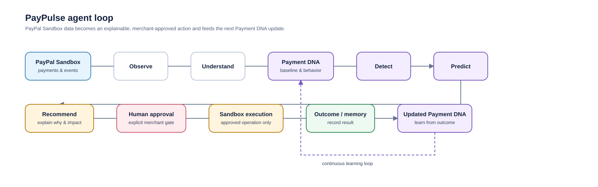

# PayPulse

> **Every payment has a pulse. We make it actionable.**

PayPulse is an AI Payment Intelligence & Action Agent for the PayPal AI Hackathon. It turns merchant payment behavior into explainable **Payment DNA**, prioritizes meaningful change, and prepares human-approved next actions.

## Current status — Code hardening complete; Clerk authentication integrated

PayPulse now fails closed for authentication and persistence: production requires PostgreSQL and Clerk authentication. The authoritative production chain is **Clerk's verified session → `AuthenticatedActor` → Clerk active Organization ID as `merchantId` + mapped Organization role → `requireAuthenticatedActor()` → PayPulse APIs**. The browser never supplies PayPulse identity, role, or merchant facts. Production readiness requires `PAYPULSE_AUTH_MODE=external`, `CLERK_SECRET_KEY`, and `NEXT_PUBLIC_CLERK_PUBLISHABLE_KEY`; requests without a signed-in Clerk user or active Organization are denied. Local development is explicit: set `PAYPULSE_AUTH_MODE=development`, `PAYPULSE_PERSISTENCE=memory`, and a server-only `PAYPULSE_DEV_AUTH_TOKEN`; then enter that token only in the local-development access screen. Development sessions are signed, HttpOnly, SameSite=Strict, and disabled in production.

All merchant data, actions, executions, outcomes, and learning records are repository-scoped by authenticated merchant. API bodies are bounded and schema-validated, request IDs are propagated, security headers are enabled, and a process-local rate guard complements (but does not replace) a deployment gateway rate limit.

## Current status — Phase 9 PayPal Sandbox Verification

The immersive 3D Command Center connects normalized, read-only **PayPal Sandbox** intelligence to evidence-bound action recommendations with explicit `paypal_sandbox` provenance. Demo remains an explicit `?source=demo` mode, is never mixed with Sandbox data, and has execution disabled.

Phase 6 deterministic rules create review-only action candidates from eligible Payment DNA insights. Each candidate includes WHY, evidence, what will happen, conditional expected impact, limits, source, expiry, and explicit merchant approval/rejection. Sparse evidence returns **“No actionable recommendation can be generated from the available evidence.”**

Phase 9 keeps intelligence recommendations non-financial and adds one distinct, explicit merchant-created **PayPal Sandbox payment verification** action. After approval, it creates one fixed server-configured Orders v2 Sandbox order, requires a Sandbox buyer approval step, retrieves the stored known order, captures only when PayPal reports it approved, then retrieves and verifies the resulting provider state. Order creation, browser redirects, and UI state never establish success. PayPulse records success only after PayPal returns a completed order and completed capture; the UI labels the workflow **Sandbox payment — no real money**.

### PayPal reporting capability

OAuth verification and reporting authorization are separate. A real local Sandbox check verified OAuth (`200`) but Transaction Search reached PayPal and returned `403`, which PayPulse classifies as `unsupported_capability`. The UI explicitly states **“PayPal Transaction Reporting is unavailable for this Sandbox app/account.”** No transaction/customer records are fabricated and Demo remains an explicit, isolated source. The supported alternative is documented Orders v2 point lookup only for a known PayPulse-created verification order ID; it is not merchant reporting history or a Transaction Search substitute.

### Run the command center

```bash
npm install
npm run dev
```

## Safety boundary

PayPulse is designed for **PayPal Sandbox only** during development and demonstration:

- No real-money transactions or live PayPal endpoint
- No hard-coded credentials or browser-visible secrets
- No autonomous financially sensitive action
- Every recommendation follows **WHY → WHAT → EXPECTED IMPACT → APPROVAL**
- PayPal execution is capability-gated: approval alone never triggers a payment; only the dedicated Sandbox verification action may create a fixed order, and provider completion is independently retrieved before success is recorded

## Documentation

- **[Phase 1 Engineering Blueprint](docs/PHASE_1_ENGINEERING_BLUEPRINT.md)**
- **[Phase 2 PayPal Sandbox local setup](docs/PAYPAL_SANDBOX_LOCAL_SETUP.md)**
- **[Phase 2 OAuth connectivity verification](docs/PAYPAL_SANDBOX_CONNECTIVITY.md)**
- **[Phase 3 Command Center](docs/phases/PHASE_3_COMMAND_CENTER.md)**
- **[Phase 4 PayPal Sandbox data integration](docs/phases/PHASE_4_PAYPAL_DATA_INTEGRATION.md)**
- **[Phase 5 Payment DNA + Intelligence Engine](docs/phases/PHASE_5_PAYMENT_INTELLIGENCE.md)**
- **[Phase 6 Agentic Action Engine + Human Approval](docs/phases/PHASE_6_AGENTIC_ACTION_ENGINE.md)**
- **[Phase 7 PayPal Sandbox Action Execution Boundary](docs/phases/PHASE_7_PAYPAL_ACTION_EXECUTION.md)**
- **[Phase 8 Outcome Learning](docs/phases/PHASE_8_OUTCOME_LEARNING.md)**
- **[Phase 9 Real PayPal Sandbox Verification](docs/phases/PHASE_9_PAYPAL_SANDBOX_VERIFICATION.md)**

## Product loop



## Verification

```bash
npm run lint
npm run typecheck
npm test
npm run build
```

The credential-backed Sandbox connectivity test runs only when the local developer environment has been securely configured; it never requires credentials in Git, the UI, or chat.

## Deployment and operations

1. Provision PostgreSQL and apply versioned migrations with `npm run db:migrate` (alias: `npm run migrate`; the runner does not print `DATABASE_URL`).
2. Configure Clerk with Organizations, set `PAYPULSE_AUTH_MODE=external`, `CLERK_SECRET_KEY`, and `NEXT_PUBLIC_CLERK_PUBLISHABLE_KEY` through deployment secret management. Clerk middleware verifies the session; PayPulse maps the verified active Organization ID to its merchant ID. The role map is `org:admin` → `owner`, explicitly configured `org:operator` → `operator`, and `org:member` or any unknown role → `viewer` (least privilege). Users must choose an active Organization.
3. Put HTTPS, a shared/routing-aware rate limit, structured request-ID log correlation, and secret management in front of the application. The in-process guard is only a local safety layer.
4. Use `/api/health` for liveness and `/api/readiness` for deployment readiness (`/health` and `/ready` remain compatibility paths). Readiness reports sanitized application, database, Clerk configuration, PayPal Orders configuration, and unverified-reporting checks; it never emits credentials or raw provider responses.
5. Configure only PayPal **Sandbox** credentials and run `npm run verify:paypal-sandbox` from the secured deployment environment. Transaction Search may remain unavailable (`403`) even with valid OAuth; PayPulse must present that as an unsupported reporting capability, not empty history.

**CODE HARDENING COMPLETE — EXTERNAL IDENTITY INTEGRATED.** A deployed PostgreSQL instance/migration run, configured Clerk instance and Organization memberships, credential-gated Sandbox verification, and target-browser/GPU checks were not performed by this repository pass.
