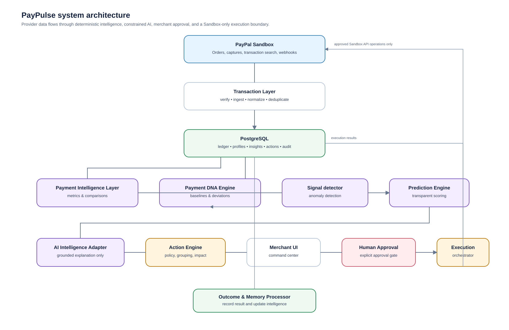
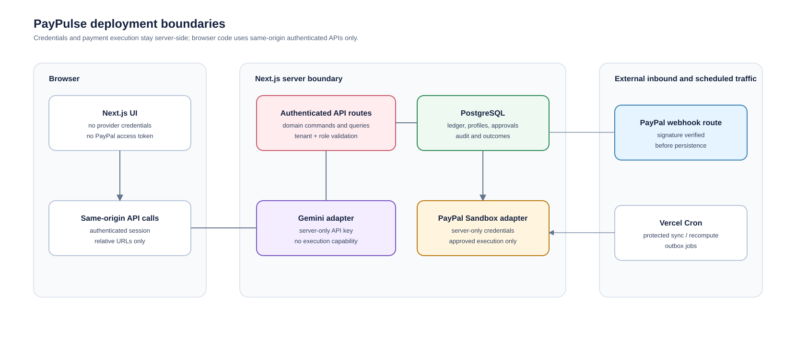
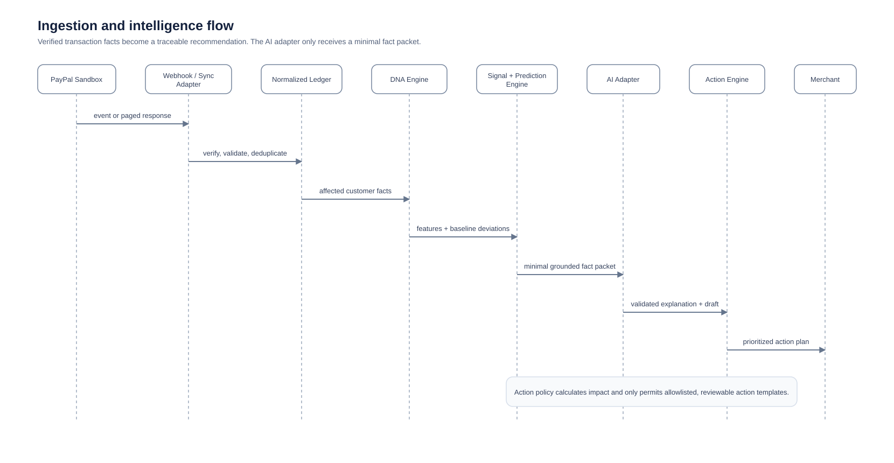
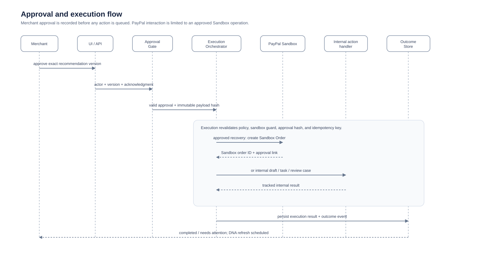
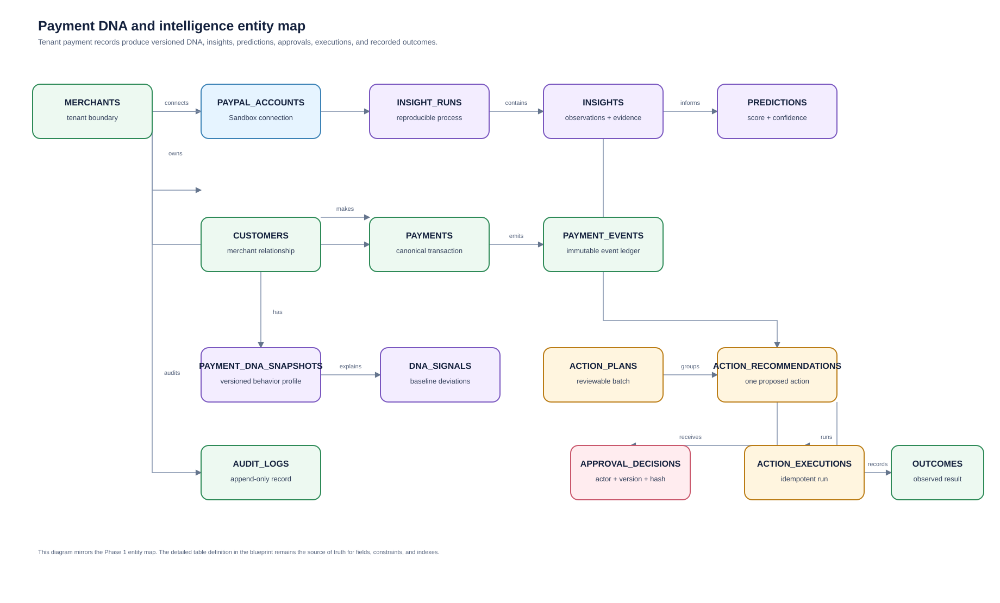
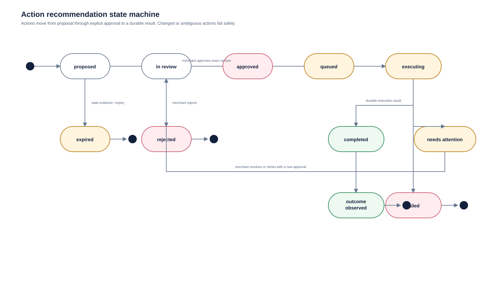

# PayPulse — Phase 1 Engineering Blueprint

> **Product tagline:** _Every payment has a pulse. We make it actionable._
>
> **Phase boundary:** This document defines the product and implementation architecture for Phase 1. It intentionally does **not** implement an application or initiate any live payment activity. Every payment integration described here is restricted to **PayPal Sandbox**.

**Status:** Architecture approved for implementation planning  
**Audience:** Hackathon team, engineering, product/design, and demo presenters  
**Primary outcome:** An explainable AI payment intelligence agent that produces reviewable action plans—not a dashboard, transaction table, or open-ended chatbot.

---

## Contents

1. [Product vision](#1-product-vision)
2. [Target users](#2-target-users)
3. [Problem and solution](#3-problem-and-solution)
4. [Core user journey](#4-core-user-journey)
5. [Complete feature list and scope](#5-complete-feature-list-and-scope)
6. [System architecture](#6-system-architecture)
7. [Component architecture](#7-component-architecture)
8. [Data flow](#8-data-flow)
9. [Database schema](#9-database-schema)
10. [Payment DNA data model](#10-payment-dna-data-model)
11. [AI intelligence architecture](#11-ai-intelligence-architecture)
12. [Action engine and approval architecture](#12-action-engine-and-approval-architecture)
13. [PayPal Sandbox integration points](#13-paypal-sandbox-integration-points)
14. [API endpoint plan](#14-api-endpoint-plan)
15. [Environment variables](#15-environment-variables)
16. [Security architecture](#16-security-architecture)
17. [Error handling and operational resilience](#17-error-handling-and-operational-resilience)
18. [Project structure](#18-project-structure)
19. [UX, screens, and UI components](#19-ux-screens-and-ui-components)
20. [State and data management](#20-state-and-data-management)
21. [Demo scenario](#21-demo-scenario)
22. [Hackathon judging alignment](#22-hackathon-judging-alignment)
23. [Development phases](#23-development-phases)
24. [Testing strategy](#24-testing-strategy)
25. [Deployment strategy](#25-deployment-strategy)
26. [Risks and mitigations](#26-risks-and-mitigations)
27. [Definition of Done](#27-definition-of-done)
28. [Phase 1 completion report](#28-phase-1-completion-report)

---

## Product guardrails and design principles

These principles govern every implementation decision:

1. **Sandbox only.** `PAYPAL_ENV` must be `sandbox`; the application must reject a live PayPal base URL at startup and before any execution call.
2. **Human approval is a hard gate.** AI can observe, score, explain, and propose. It cannot invoke a financial PayPal operation, send a customer-facing recovery link, refund, capture, or otherwise execute an action without an explicit, authenticated merchant approval recorded against that exact action version.
3. **Reason first, model second.** Deterministic transaction facts and Payment DNA features are the source of truth. AI translates those facts into understandable language and structured suggestions; it does not invent facts or calculate ledger totals.
4. **Agent, not chatbot.** The default product experience is a prioritized “what changed / why it matters / what to do” command center followed by a reviewable action plan. Conversational UI is not an MVP dependency.
5. **Explainable by design.** Every prediction and recommendation exposes evidence, a confidence level, limitations, and expected impact.
6. **Payment execution is isolated.** The PayPal client is reachable only from the execution service. The AI provider and UI never receive PayPal secrets or execution capability.
7. **Auditable and idempotent.** Approval, execution intent, PayPal request ID, response reference, outcome, and actor are durably recorded. Retries never create duplicate actions.
8. **Useful with imperfect data.** Signals show data coverage and confidence rather than implying certainty. Sparse history produces “watch” insights, not aggressive recommendations.

---

# 1. Product vision

**PayPulse is an AI Payment Intelligence & Action Agent for merchants.** It continuously turns PayPal Sandbox payment behavior into an evolving behavioral profile—**Payment DNA**—for each customer. It notices material change, predicts likely commercial outcomes, presents a compact, explainable plan, and safely coordinates only merchant-approved action.

Instead of asking a merchant to sift through payments and decide what matters, PayPulse answers:

- **What changed?** “Revenue is down 18% this week; seven customer payment patterns changed.”
- **Why is it material?** “Alex normally pays about $120 every 14 days, with a 1.2-day delay. It has been 25 days with no payment, while their three-month cadence was stable.”
- **What may happen next?** “There is a high likelihood of a delayed payment and a moderate churn risk.”
- **What is the safest next move?** “Prepare a respectful reminder or a personalized retention playbook.”
- **What happened after approval?** “The approved Sandbox recovery checkout was created; the result is recorded and the customer’s DNA will update as new events arrive.”

The key innovation is a closed, accountable loop:


Success is not “a merchant can view charts.” Success is that a merchant can understand and approve an economically meaningful next action in under a minute, with the evidence required to trust it.

# 2. Target users

| User | Job to be done | Pain today | PayPulse value |
|---|---|---|---|
| **Owner-operator / small merchant** | Keep revenue predictable without a finance team | Learns about a missed payment too late; has no time to analyze trends | A concise action queue ranked by commercial importance |
| **Finance / operations manager** | Monitor collections, revenue health, and exceptions | Exports transactions into spreadsheets; follows up inconsistently | Customer-level DNA, traceable recommendations, and an audit trail |
| **Customer success / retention lead** | Preserve valuable repeat relationships | Cannot see subtle behavioral decline early enough | Timely, explainable opportunity and risk signals |
| **Demo evaluator / hackathon judge** | Assess a credible AI + PayPal workflow | Sees many generic analytics products | A visible, safe agentic loop from payment event to approved Sandbox action |

**MVP primary persona:** A small-to-mid-size merchant operations lead who has repeat customers and wants to act before late or lost revenue becomes obvious.

# 3. Problem and solution

## Problem statement

Payment systems record events, but merchants need decisions. Transaction histories do not naturally reveal whether a customer is late relative to their own norm, whether a decline in frequency is a temporary variation or churn signal, or which action is worth taking first. Existing dashboards emphasize totals and tables, leaving merchants to detect patterns, judge risk, write outreach, and manually reconcile outcomes.

An autonomous system that acts on payments would create unacceptable risk. A useful system must therefore pair intelligent recommendation with **specific evidence, merchant control, and an auditable execution boundary**.

## Solution statement

PayPulse transforms normalized PayPal Sandbox events into versioned Payment DNA profiles. A deterministic intelligence layer computes behavior changes and prediction inputs; a constrained AI layer turns grounded evidence into business-ready explanations and action suggestions. An action policy engine groups recommendations into a plan. The merchant reviews **WHY → WHAT → EXPECTED IMPACT → APPROVAL** for every action. Only then can a separate execution service perform a permitted Sandbox operation or record an internal, non-financial operational task. Outcomes feed the next DNA computation.

## Product positioning

| Not PayPulse | PayPulse |
|---|---|
| A generic payment dashboard | A payment behavior intelligence and action agent |
| A transaction table with filters | Customer-specific Payment DNA with change detection |
| A chatbot that speculates | A fact-grounded, structured recommendation system |
| Fully autonomous collection automation | Human-approved, policy-controlled action orchestration |
| A black-box risk score | Confidence-rated predictions with contributing evidence |

# 4. Core user journey

1. **Open the Intelligence Brief.** The merchant sees a calm, prioritized briefing: “Revenue is down 18% this week. I found 7 customers whose payment behavior has changed.”
2. **Understand the pulse.** The merchant expands the evidence. PayPulse shows revenue and volume movement, successful/failed payment context, the affected Payment DNA traits, baseline versus current behavior, signal freshness, and confidence.
3. **Review the action plan.** The agent groups recommendations by intent (recovery, retention, review) and presents each as:
   - **WHY:** evidence and customer DNA deviation;
   - **WHAT:** the proposed action and scope;
   - **EXPECTED IMPACT:** directional, confidence-calibrated benefit;
   - **APPROVAL:** explicit accept/reject control.
4. **Inspect exceptions.** The merchant can open a customer intelligence view or unusual transaction review without losing the action-plan context.
5. **Approve selected actions.** The merchant selects one or more recommendations, acknowledges the Sandbox effect, and confirms. Approval is tied to recommendation version, actor, timestamp, and idempotency key.
6. **Execute safely.** PayPulse creates a durable execution job. Internal actions create tracked tasks/drafts. A PayPal-backed recovery action creates a **Sandbox** checkout order only after approval; it never captures a customer’s funds automatically.
7. **See completion and learning.** The merchant receives “Action completed. Outcomes recorded. Payment DNA updated.” The detail view distinguishes an immediate execution result from later commercial outcome. Incoming Sandbox events trigger recalculation of relevant profiles.

# 5. Complete feature list and scope

## Complete product feature catalog

### A. Payment intelligence

- Revenue, transaction volume, success rate, failure rate, average transaction value, repeat-payment rate, and payment-frequency metrics.
- Configurable comparison periods: current 7/30 days compared with prior equivalent period.
- Transaction normalization across PayPal orders, captures, refunds, and webhook updates.
- Merchant-facing metric definitions and data-freshness indication.

### B. Payment DNA

- Customer identity resolution from PayPal payer identifiers and safe, display-level attributes.
- Rolling behavioral baselines for amount, cadence, timeliness, reliability, recency, relationship depth, and trend.
- Data sufficiency indicators and versioned snapshots.
- Side-by-side “normal behavior vs. current behavior” explanation.

### C. Insight and anomaly detection

- Revenue/volume/success-rate change detection.
- Customer cadence break, amount deviation, failed-payment cluster, inactive-repeat-customer, and unusual transaction signals.
- Severity ranking based on commercial impact, anomaly magnitude, and evidence confidence.
- Deduplication so the same underlying issue does not create a noisy feed.

### D. Prediction

- Likely payment delay.
- Customer churn / inactivity risk.
- Unusual transaction behavior.
- Revenue trend / cash-flow risk.
- Potential missed expected payment.
- Confidence label, evidence list, and “not a guarantee” explanation.

### E. Recommendations and action plans

- Payment reminder draft.
- Customer follow-up recommendation.
- Personalized retention playbook/draft.
- Unusual activity review case.
- Cash-flow risk alert.
- Optional approved Sandbox recovery checkout creation.
- Grouping, prioritization, plan impact summary, approve/reject, and action history.

### F. Outcome and learning

- Execution status, PayPal Sandbox references, manual outcome entry, and event-based outcome ingestion.
- Outcome labels such as `completed`, `payment_received`, `no_response`, `dismissed`, and `false_positive`.
- Recalculation of DNA and model/effectiveness reporting after outcomes.

### G. Trust, safety, and operations

- Sandbox-only enforcement; explicit Sandbox badge throughout the UI.
- Role-aware merchant approval; immutable audit events.
- Data freshness and integration health.
- Error recovery, idempotency, and reconciliation screens.

## MVP versus optional features

| Scope | Included in Phase 2 MVP | Later / explicitly not required for MVP |
|---|---|---|
| Data | Seeded, realistic synthetic data plus PayPal Sandbox ingestion path; 7/30-day metrics | Multi-provider payment aggregation, production data migration |
| DNA | Amount, cadence, recency, successful-payment reliability, relationship depth, current-vs-baseline change | Cohort embeddings, cross-merchant benchmarks, sophisticated ML training |
| Intelligence | Deterministic rules + lightweight scoring, AI-written grounded explanation, anomaly feed | Fully autonomous forecasting models, free-form deep analysis assistant |
| Predictions | Delay, inactivity/churn, unusual amount/cadence, revenue trend, confidence | Credit decisions, fraud determinations, decisions affecting eligibility |
| Actions | Reminder and retention drafts, review case, cash-flow alert, approved Sandbox recovery-order creation | Live email/SMS dispatch, automatic retries/collections, production payment actions |
| Approval | Per-action selection, review modal, actor/timestamp/version audit | Multi-step approval chains, teams/escalation policies |
| Outcome | Execution log, manual labels, webhooks update payment outcome and DNA | Causal experimentation framework, automated policy optimization |
| UX | Responsive desktop/mobile intelligence brief, action plan, DNA detail, outcome history, settings | Native mobile app, elaborate reporting builder |

**MVP cut line:** Do not build a chatbot, production payments, customer email delivery, a data warehouse, multi-currency analytics, or opaque predictive ML before the core loop is polished.

# 6. System architecture

## Recommended technology stack

| Layer | Choice | Why it fits the hackathon |
|---|---|---|
| Web application | **Next.js (App Router), React, TypeScript** | One cohesive full-stack repository; server components and route handlers reduce operational surface |
| Styling / design system | **Tailwind CSS** + a small accessible component set | Fast, responsive, visually intentional UI without a heavyweight design dependency |
| Validation | **Zod** | Shared runtime validation for API input, AI structured output, and environment configuration |
| Persistence | **Supabase PostgreSQL** with **Drizzle ORM** | Free/low-cost managed Postgres, migrations, relational integrity, optional Supabase Auth |
| Authentication | **Supabase Auth** (email magic link for demo) | A practical, low-cost merchant identity source with server-side session checks |
| AI | **Gemini API, a current Gemini Flash-class model** | Low-cost, fast narrative/recommendation generation; called only from server-side AI adapter |
| Payments | **PayPal REST APIs + webhooks, Sandbox endpoints only** | Demonstrates the PayPal integration and real sandbox objects without live money |
| Scheduling | **Vercel Cron** invoking protected Next.js routes | Sufficient for periodic sync/recompute at hackathon scale |
| Deployment | **Vercel** + Supabase + PayPal Developer Sandbox | Low-ops, GitHub-connected deployment suited to a demo |
| Testing | Vitest, React Testing Library, Playwright, and PayPal Sandbox contract smoke tests | Covers scoring correctness, UI decisions, and real sandbox flow |

The PayPal adapter should use server-side `fetch` behind a typed client. This minimizes SDK lock-in and makes API requests, `PayPal-Request-Id`, and environment guards explicit. An official server SDK can be evaluated later without leaking it across domain code.

## Logical architecture



## Deployment boundaries



# 7. Component architecture

| Component | Responsibility | Must not do |
|---|---|---|
| **Transaction Layer** | Fetch/receive PayPal Sandbox events, verify, normalize, deduplicate, and maintain cursors | Calculate AI prose or execute recommendations |
| **Payment Intelligence Service** | Compute merchant metrics and comparison windows from normalized ledger data | Treat raw PayPal payloads as UI models |
| **Payment DNA Engine** | Create versioned per-customer behavioral features and deviations | Make financial calls or use unvalidated LLM output as a fact |
| **Signal Detector** | Convert metric/DNA deviations into deduplicated, prioritized observations | Contact customers or mutate PayPal state |
| **Prediction Engine** | Apply transparent rules/scoring to produce outcome probability bands and feature contributions | Claim causal certainty or make credit/fraud decisions |
| **AI Intelligence Adapter** | Convert an approved fact packet into schema-validated explanation and draft language | Query PayPal, select arbitrary tools, or execute actions |
| **Action Engine** | Map signals/predictions to allowed recommendation templates, calculate expected impact, group plan | Bypass merchant approval |
| **Approval Service** | Record an authenticated explicit decision against a recommendation version | Change the approved payload after approval |
| **Execution Orchestrator** | Revalidate approval/policy, create an idempotent job, execute eligible Sandbox/internal task | Let an AI model choose parameters or retry an ambiguous financial call blindly |
| **Outcome/Memory Processor** | Persist immediate execution and delayed business outcomes; trigger DNA recomputation | Overwrite historical facts or silently change prior audit records |
| **Command Center UI** | Make urgency, evidence, approval state, and action result legible | Hold secrets or calculate authoritative payment metrics in-browser |

The app uses a **functional core, imperative shell** pattern: scoring functions operate on typed normalized records and return deterministic outputs; adapters perform I/O around those functions.

# 8. Data flow

## A. Ingestion and intelligence flow



## B. Approval and execution flow



## C. Data ownership and freshness

- **PayPal is authoritative** for Sandbox order/capture lifecycle events.
- **PayPulse is authoritative** for normalized analytics, DNA versions, insight/action state, approvals, and operational outcomes.
- Raw PayPal payloads are retained in a restricted `payment_events` record for traceability; UI reads canonical normalized tables, never raw payloads.
- Every briefing carries `calculated_at`, source `last_synced_at`, and a confidence/data-coverage label.

# 9. Database schema

Use PostgreSQL with UUID primary keys, UTC `timestamptz`, `numeric(18,2)` (or minor-unit integer plus currency where strict precision is needed), and JSONB only where variable provider payloads or structured model evidence are truly appropriate. All business records include `merchant_id` and are protected by merchant-scoped access rules.

## Entity map



## Tables

| Table | Purpose and key fields | Important constraints / indexes |
|---|---|---|
| `merchants` | Tenant: `id`, `name`, `timezone`, `status`, `created_at` | unique normalized merchant slug if used |
| `merchant_members` | Auth mapping: `merchant_id`, `user_id`, `role` (`owner`, `operator`, `viewer`) | unique `(merchant_id, user_id)`; only owner/operator may approve |
| `paypal_accounts` | Sandbox connection metadata: `merchant_id`, `paypal_merchant_id`, `environment`, `status`, `last_synced_at` | `environment` check = `sandbox`; unique `(merchant_id, environment)`; do not store client secret |
| `sync_cursors` | Incremental sync state: `paypal_account_id`, `stream`, `cursor_value`, `last_success_at` | unique `(paypal_account_id, stream)` |
| `customers` | Canonical customer: `merchant_id`, `external_payer_id`, `display_name`, `email_hash`, `first_payment_at`, `last_payment_at` | unique `(merchant_id, external_payer_id)`; minimize direct PII |
| `payments` | Canonical payment/order/capture: `merchant_id`, `customer_id`, `paypal_order_id`, `paypal_capture_id`, `amount`, `currency`, `status`, `occurred_at`, `source` | unique non-null PayPal IDs; indexes `(merchant_id, occurred_at)`, `(customer_id, occurred_at)` |
| `payment_events` | Immutable received event ledger: `merchant_id`, `payment_id`, `provider_event_id`, `event_type`, `occurred_at`, `payload_json`, `payload_hash`, `verified_at` | unique `(merchant_id, provider_event_id)`; restricted access; index event time |
| `metric_snapshots` | Materialized merchant time-window metrics: `merchant_id`, `period_start/end`, `metric_key`, `value`, `comparison_value`, `calculated_at` | unique `(merchant_id, period_start, period_end, metric_key)` |
| `payment_dna_snapshots` | Versioned customer profile: IDs, `customer_id`, `version`, `as_of_at`, `observation_count`, `feature_json`, `confidence`, `profile_state` | unique `(customer_id, version)`; index newest snapshot per customer |
| `dna_signals` | Atomic deviations: `dna_snapshot_id`, `signal_type`, `severity`, `baseline_value`, `current_value`, `deviation`, `evidence_json` | index `(dna_snapshot_id, severity desc)` |
| `insight_runs` | Reproducible processing run: `merchant_id`, `trigger`, `input_window`, `rules_version`, `model_version`, `started/finished_at` | index by merchant and time |
| `insights` | Merchant/customer observations: `insight_run_id`, `customer_id?`, `kind`, `severity`, `status`, `evidence_json`, `explanation`, `confidence` | fingerprint unique for active duplicate suppression; index active priority |
| `predictions` | Explainable prediction: `insight_id`, `type`, `risk_score`, `confidence`, `horizon_days`, `factors_json`, `model_version`, `expires_at` | one active type per insight; score check 0–100 |
| `action_plans` | A reviewable batch: `merchant_id`, `title`, `status`, `summary`, `expected_impact_json`, `generated_at`, `expires_at` | index `(merchant_id, status, generated_at desc)` |
| `action_recommendations` | One actionable item: `plan_id`, `insight_id`, `customer_id?`, `action_type`, `payload_json`, `why_json`, `expected_impact_json`, `state`, `version`, `policy_code` | only draft/reviewable types allowed; `(id, version)` used on approval |
| `approval_decisions` | Immutable merchant decision: `recommendation_id`, `recommendation_version`, `actor_id`, `decision`, `reason`, `approved_payload_hash`, `decided_at` | one current decision per recommendation/version; append-only audit |
| `action_executions` | Idempotent run: `recommendation_id`, `approval_id`, `idempotency_key`, `state`, `operation_type`, `paypal_request_id`, `paypal_resource_id`, `request/redacted_response`, `started/finished_at` | unique `idempotency_key`, unique `paypal_request_id` |
| `outcomes` | Immediate or delayed result: `execution_id`, `kind`, `status`, `occurred_at`, `observed_at`, `details_json`, `source` | index by execution/status |
| `audit_logs` | Security/business audit: `merchant_id`, `actor_type/id`, `event_type`, `entity_type/id`, `before_hash`, `after_hash`, `ip_hash`, `created_at` | append-only; index tenant/time |
| `outbox_jobs` | Reliable async work: `type`, `aggregate_id`, `payload_json`, `state`, `attempts`, `available_at`, `idempotency_key` | unique idempotency key; safe retry coordination |

### Retention and privacy notes

- Store a one-way normalized email hash for identity matching; store display name only when needed for an approved draft. Avoid copying unnecessary payer address/details from provider payloads into UI tables.
- Encrypt any legally necessary sensitive payload at rest or retain a redacted subset; restrict raw payload table queries to server-side operations/auditors.
- Keep immutable audit data according to documented demo retention policy; support tenant purge/delete policy before production.

# 10. Payment DNA data model

**Payment DNA** is a versioned, explainable behavioral profile, not a hidden AI embedding and not a creditworthiness score. It summarizes a customer only in the context of the current merchant’s own payment relationship.

## Profile dimensions

| Dimension | Example features | Computation / interpretation |
|---|---|---|
| **Relationship** | first/last payment, successful payment count, lifetime value, repeat status | Determines whether enough history exists and whether “repeat customer” is justified |
| **Value signature** | median amount, mean amount, variability, typical currency | Uses median as the stable “typical payment”; detects material amount departure |
| **Cadence signature** | median days between successful payments, expected-next-payment date, cadence variance | Identifies an overdue or accelerated pattern relative to this customer |
| **Timeliness / reliability** | success ratio, failed-attempt count, average settlement delay when available | Separates a single late payment from a sustained reliability change |
| **Recency / momentum** | days since latest success, 30/60/90-day spend and frequency deltas | Captures whether a formerly active relationship is cooling |
| **Current state** | active, watch, delayed, declining, unusual, new/insufficient data | A human-readable classification based on defined rules |
| **Evidence quality** | observation count, history span, feature coverage, freshness | Limits confidence; avoids false precision for new customers |

## Computation specification

**Baseline window:** default trailing 90 days or all available history up to 180 days. **Recent window:** trailing 30 days, with an event-triggered view for newly received payments. A customer needs at least 3 successful payments across 21 days before cadence-based recommendations are eligible; otherwise show `new_or_insufficient_history`.

Illustrative deterministic formulas (calibrate against demo data; preserve formulas/version in code):

```text
typical_amount          = median(successful payment amounts in baseline)
typical_cadence_days    = median(gaps between successful payments)
expected_next_date      = last_success_at + typical_cadence_days
recency_ratio           = days_since_last_success / max(typical_cadence_days, 1)
amount_deviation        = abs(latest_amount - typical_amount) / max(typical_amount, 1)
frequency_change        = (recent_success_count - prior_equal_period_count)
                          / max(prior_equal_period_count, 1)
reliability_rate        = successes / (successes + qualifying_failures)
coverage_confidence     = weighted(observation_count, history_days, freshness, feature_coverage)
```

Example signal rules:

- `cadence_break`: current gap is at least `1.5 ×` a stable customer’s usual cadence and there are at least 3 prior intervals.
- `amount_anomaly`: latest amount differs from customer median by at least 2 robust deviations or a business-configured percentage threshold.
- `activity_decline`: recent frequency or value drops at least 40% versus a comparable prior period with sufficient volume.
- `failed_payment_cluster`: at least 2 qualifying failure events within 7 days following historical success ratio above 80%.
- `unusual_transaction`: a high amount/cadence deviation, shown as a review request—not a fraud conclusion.

## DNA snapshot example

```json
{
  "customer_id": "cust_alex",
  "version": 12,
  "as_of_at": "2026-10-03T10:00:00Z",
  "profile_state": "delayed_watch",
  "confidence": { "level": "high", "score": 0.86, "reason": "9 successful payments across 154 days" },
  "relationship": { "segment": "repeat", "successful_payment_count": 9, "lifetime_value": 1084.00 },
  "value_signature": { "typical_amount": 120.00, "amount_variability": "low", "currency": "USD" },
  "cadence_signature": { "typical_days": 14, "expected_next_date": "2026-09-22", "days_over_expected": 11 },
  "reliability": { "success_rate": 0.90, "average_delay_days": 1.2 },
  "momentum": { "recent_activity_change_pct": -40, "days_since_last_success": 25 },
  "current_signals": ["cadence_break", "activity_decline"],
  "rules_version": "dna-v1"
}
```

## DNA update rules

1. Ingested payment events identify affected customers.
2. Recompute their profile with an atomic new version; never edit the prior snapshot.
3. Compare the new snapshot to baseline and prior snapshot; generate/reopen/resolve signals.
4. Link any new insight/action to its DNA snapshot version so its reasoning remains reproducible.
5. After a later payment/outcome, recompute and mark earlier prediction/result as resolved, supported, unsupported, or inconclusive where evidence permits.

# 11. AI intelligence architecture

## Division of responsibility

| Layer | Inputs | Output | Authority |
|---|---|---|---|
| Deterministic metrics/DNA/rules | Normalized payment facts | Metrics, feature deltas, signals, risk bands | Authoritative numerical facts |
| Prediction engine | Signals + formula weights | Score, confidence, horizon, feature contributions | Authoritative internal score; not a guarantee |
| Gemini intelligence adapter | **Read-only fact packet**, permitted action templates, tone rules | Strict JSON explanation, concise summary, draft outreach/retention text | Language and prioritization assistance only |
| Action policy engine | Validated AI response + deterministic scores + policy | Recommendation(s) or no action | Final recommendation eligibility |
| Merchant | Evidence and proposal | Approve/reject | Sole financial-action authority |
| Execution service | Approved immutable payload | Internal result or PayPal Sandbox response | Performs only allowed approved operation |

## Grounded AI request contract

The server constructs a minimal prompt from a typed fact packet. It does **not** give the model database access, PayPal credentials, action endpoints, raw untrusted transaction descriptions, or authority to call tools.

```json
{
  "task": "Explain a payment-behavior recommendation in clear merchant language.",
  "facts": {
    "customer_display_name": "Alex",
    "relationship_segment": "repeat",
    "typical_payment_usd": 120,
    "typical_cadence_days": 14,
    "days_since_last_success": 25,
    "recent_activity_change_pct": -40,
    "risk_band": "high",
    "confidence": "high",
    "allowed_action_templates": ["prepare_payment_reminder", "recommend_retention_follow_up"]
  },
  "required_output_schema": {
    "summary": "string under 240 characters",
    "why_bullets": ["only cite supplied facts"],
    "limitations": ["string"],
    "recommended_template": "one allowed template",
    "draft_copy": "optional concise merchant-review draft"
  }
}
```

Server validation rejects any response that:

- fails the Zod schema;
- names metrics not present in the fact packet;
- recommends an action outside the allowed template list;
- contains prohibited financial promises, sensitive inferences, or a claim of certainty;
- includes an invalid confidence term.

A deterministic template renderer is the fallback if Gemini is unavailable, malformed, or rejected. The user still receives the insight and safe action proposal.

## Prediction design

Predictions are interpretable rules/scoring in MVP, not a misleading “AI says so” black box.

| Prediction | Illustrative contributing features | Output |
|---|---|---|
| Likely payment delay | cadence break, days over expected, stable prior cadence, current failure events | risk band/0–100, 7/14-day horizon, factors |
| Churn / inactivity risk | recency ratio, 30-day frequency/value fall, repeat history, trend duration | risk band/0–100, 30-day horizon, factors |
| Unusual behavior | amount robust deviation, new cadence, failure cluster, profile confidence | `review recommended` level, not fraud verdict |
| Revenue trend / cash-flow risk | merchant aggregate frequency/amount change, expected missed-payment value, affected customer count | directional 7/30-day scenario, confidence |
| Potential missed payment | expected-next date passed, recurring relationship evidence, recent non-payment | probability band and expected amount range |

### Explainability object

Each prediction must persist:

- `score` / `risk_band` and confidence;
- prediction horizon and expiration;
- ordered positive factors with measured baseline/current values;
- mitigating factors (for example, short history);
- rules/model version and snapshot IDs;
- plain-language limitations: “This is a behavior signal based on nine prior successful payments, not a guarantee that Alex will not pay.”

## AI safety controls

- Use low-temperature structured generation and JSON-only response mode when supported.
- Never send secret values or full raw payloads to the model.
- Treat provider output as untrusted input, validate, sanitize before render, and log redacted request/response metadata.
- Prompt injection defense: no raw customer-entered free text is instruction-bearing; event descriptions are quoted/encoded data, not prompt instructions.
- No autonomous function/tool calls by the model. The model cannot call PayPal, database mutation routes, messaging APIs, or execute code.
- Label AI-authored prose as “AI explanation based on the payment data shown,” while numerical facts remain visibly sourced from Payment DNA.

# 12. Action engine and approval architecture

## Recommendation taxonomy

| Action type | Why / What | Expected impact | Execution after approval |
|---|---|---|---|
| `prepare_payment_reminder` | A recurring payment appears late; create respectful draft copy and follow-up task | Improve chance of timely merchant follow-up; no guaranteed recovery | Internal draft/task only. **Not** auto-sent by PayPal or PayPulse MVP |
| `recommend_retention_follow_up` | Valuable customer activity is declining; provide a tailored playbook/draft | Preserve a repeat relationship; impact expressed as directional | Internal task/draft; merchant chooses external contact channel |
| `open_unusual_activity_review` | Transaction differs materially from the customer’s pattern | Faster manual review; explicitly not a fraud finding | Internal review case with evidence |
| `highlight_cash_flow_risk` | Aggregate expected-payment gap is material | Better near-term planning | Internal alert/acknowledgment |
| `create_sandbox_recovery_checkout` | Merchant wants a payment-recovery checkout for an approved amount/context | Provides a valid Sandbox PayPal checkout object; no money is captured automatically | Creates a PayPal Sandbox Order only; customer approval/capture remains in PayPal’s normal Sandbox flow |

The first four actions visibly demonstrate agentic reasoning and human operational control without pretending PayPal sends reminders. The final action is the controlled PayPal Sandbox API operation for a compelling end-to-end demo.

## Action state machine



### Approval contract

Approval is valid only when all checks pass:

1. Session belongs to the target merchant and has `owner` or `operator` role.
2. Recommendation is `in_review`, unexpired, and its submitted `version` matches current version.
3. Approval sees the immutable payload hash, impact estimate, and explicit `sandbox_only` notice.
4. Action policy says type/amount/currency/scope is permitted.
5. The approval decision and audit event persist before any execution is queued.
6. Any materially changed data creates a **new recommendation version**; prior approval cannot transfer.

The button copy is action-specific: **“Approve & Create Sandbox Checkout”**, **“Approve & Create Reminder Draft”**, or **“Reject.”** Avoid a vague universal button that hides the effect.

## Execution controls

- `ExecutionOrchestrator` accepts an `approval_id`, not arbitrary UI parameters.
- It rechecks approval validity, tenant ownership, approved payload hash, and policy before execution.
- Each execution owns a unique internal idempotency key and uses that key as PayPal’s `PayPal-Request-Id` where supported.
- Network timeouts after a PayPal request become `needs_attention` and require reconciliation by request/resource ID. Do not silently reissue possibly successful financial operations.
- Internal drafts/tasks can retry safely. PayPal API retry policy is endpoint-specific and only occurs when idempotency guarantees it.
- The UI never calls PayPal directly.

# 13. PayPal Sandbox integration points

## Required PayPal developer setup

1. Create a PayPal Developer application with **Sandbox** business and personal test accounts only.
2. Set server-only `PAYPAL_CLIENT_ID` and `PAYPAL_CLIENT_SECRET` in the deployment environment—not in source, browser bundles, logs, or docs.
3. Configure an HTTPS webhook destination at `/api/webhooks/paypal` and retain its Sandbox webhook ID.
4. Use Sandbox API base URL `https://api-m.sandbox.paypal.com` only.
5. Display a persistent `SANDBOX` environment badge and a settings health state in the product.

## Integration map

| Integration | Purpose | Phase 2 MVP treatment |
|---|---|---|
| OAuth 2 client-credentials token | Server-to-server access token for merchant’s Sandbox app context | Server-only token acquisition/cache; token never persisted to browser or DB |
| Transaction retrieval / reporting capability | Initial/backfill payment facts where the configured Sandbox account/API permissions support it | Adapter with paginated cursor and reconciliation. Validate exact availability/required permissions against current PayPal docs during implementation |
| Orders v2: create order | Create merchant-approved **Sandbox** recovery checkout | `POST /v2/checkout/orders`, `intent: CAPTURE`, return only Sandbox approval link/order ID after human approval |
| Orders v2: get order | Reconcile checkout/order state | Read after callback/webhook or ambiguity; no agent capture |
| Webhooks | Observe order/capture/refund lifecycle and update canonical ledger | Verify signature before any write; dedupe provider event IDs |
| Optional capture completion | Capture occurs in the normal purchaser-approved Sandbox checkout lifecycle | Never automatically capture simply because a merchant approved plan creation |

**Important implementation note:** PayPal’s available transaction/reporting features and permissions can vary by account, region, and API product. The transaction adapter must be capability-checked during setup. The demo must remain fully functional with seeded synthetic ledger data plus actual Sandbox order/webhook events if broad account-history retrieval is unavailable.

## PayPal actions deliberately excluded

- Production endpoints or live credentials.
- Automatic debit, capture, refund, or void performed by an AI model.
- Automatic customer messages represented as a PayPal feature.
- A request to capture an order without the normal payer approval flow.
- Storing PayPal secrets or access tokens in client storage.

# 14. API endpoint plan

All endpoints are same-origin Next.js Route Handlers under `/api`. Except the PayPal webhook, every route requires authenticated merchant context. Responses use a common `{ data, meta, error }` envelope, request IDs, typed Zod validation, and no raw provider errors.

| Method / route | Purpose | Authorization / key behavior |
|---|---|---|
| `GET /api/dashboard/brief` | Summary narrative, key metrics, prioritized active insights, plan preview, freshness | Merchant member; server computes tenant scope |
| `GET /api/metrics?window=7d` | Chart-ready payment intelligence metrics and comparisons | Member; validated window enum |
| `GET /api/insights` | Filtered insight feed by severity/status/kind | Member; cursor pagination |
| `GET /api/insights/:id` | Evidence, DNA version, prediction, related recommendation | Member and tenant-scoped |
| `GET /api/customers` | Search/list customers with state and key DNA signal | Member; minimized PII |
| `GET /api/customers/:id/dna` | Current/previous Payment DNA, trend, linked outcomes | Member and tenant-scoped |
| `GET /api/action-plans/current` | Current reviewable plan and grouped impact | Member |
| `GET /api/action-plans/:id` | Plan detail and recommendation states | Member and tenant-scoped |
| `POST /api/action-recommendations/:id/approve` | Approve exact recommendation version | Owner/operator; body includes `version`, acknowledgment; records immutable decision, queues job |
| `POST /api/action-recommendations/:id/reject` | Reject with optional reason | Owner/operator; no execution |
| `POST /api/action-recommendations/:id/execute` | Start/retry an already approved eligible action | Owner/operator; accepts no mutable action parameters; usually invoked server-side after approval |
| `GET /api/action-executions/:id` | Poll execution/result and outcome status | Member and tenant-scoped |
| `POST /api/outcomes` | Record a merchant-observed non-payment outcome | Owner/operator; schema-validated label and evidence note |
| `POST /api/paypal/sync` | Trigger a manual Sandbox sync | Owner/operator; rate-limited; queues job, never exposes provider result payload |
| `GET /api/integrations/paypal/status` | Sandbox connection, webhook, and sync health | Owner/operator |
| `POST /api/webhooks/paypal` | Receive PayPal lifecycle events | No user session; raw body signature verified, deduped, then queued |
| `POST /api/internal/jobs/process` | Process outbox batch | Cron secret/internal auth only; not browser callable |
| `POST /api/internal/recompute` | Recompute metrics/DNA/insights after sync | Cron secret/internal auth only |

### Endpoint implementation rules

- Every entity lookup includes `merchant_id`; never trust an ID alone.
- Mutations include `Idempotency-Key` where initiated from UI and use optimistic locking/version values.
- `approve` does not accept an amount, payer ID, or PayPal payload from the browser; it approves server-stored proposal data only.
- Webhook route reads the untouched raw body for verification, returns quickly, and delegates processing through `outbox_jobs`.

# 15. Environment variables

Create `.env.example` with placeholders and comments only. Never commit `.env.local`, secrets, access tokens, webhook payloads containing sensitive data, or production values.

| Variable | Required | Server-only | Purpose |
|---|---:|---:|---|
| `NODE_ENV` | yes | no | Runtime mode |
| `NEXT_PUBLIC_APP_URL` | yes | no | Canonical app URL; contains no secret |
| `DATABASE_URL` | yes | yes | Postgres connection string |
| `DIRECT_DATABASE_URL` | optional | yes | Direct migration connection if provider distinguishes pooled URL |
| `SUPABASE_URL` | yes if Supabase Auth used | server/public policy-dependent | Supabase project endpoint; public URL alone is not a secret |
| `NEXT_PUBLIC_SUPABASE_URL` | yes if browser Supabase client used | no | Browser-safe project URL |
| `NEXT_PUBLIC_SUPABASE_ANON_KEY` | yes if browser client used | no | Browser-safe anon key, protected by RLS |
| `SUPABASE_SERVICE_ROLE_KEY` | server-only admin use only | yes | Never exposed to browser; minimize use |
| `PAYPAL_ENV` | yes | yes | Must equal literal `sandbox`; fail startup otherwise |
| `PAYPAL_API_BASE` | yes | yes | Must equal `https://api-m.sandbox.paypal.com` |
| `PAYPAL_CLIENT_ID` | yes for PayPal path | yes | PayPal Sandbox application client ID |
| `PAYPAL_CLIENT_SECRET` | yes for PayPal path | yes | PayPal Sandbox application secret |
| `PAYPAL_WEBHOOK_ID` | yes for webhook verification | yes | Configured Sandbox webhook identifier |
| `GEMINI_API_KEY` | yes for AI explanation | yes | Server-side Gemini credential |
| `GEMINI_MODEL` | yes | yes | Explicit approved Gemini model identifier |
| `AUTH_SECRET` | yes if auth layer requires it | yes | Session/signing secret |
| `FIELD_ENCRYPTION_KEY` | recommended | yes | Rotation-aware encryption key for required sensitive fields |
| `CRON_SECRET` | yes in deployment | yes | Authenticates scheduled/internal job calls |
| `LOG_LEVEL` | optional | yes | Log verbosity; default avoids payload logging |
| `SENTRY_DSN` | optional | environment-specific | Error reporting; scrub PII before transport |

A startup `env.ts` module validates all variables with Zod and rejects unsafe combinations, especially a non-sandbox PayPal base URL or an accidentally public secret prefix (`NEXT_PUBLIC_PAYPAL_*`, `NEXT_PUBLIC_GEMINI_*`).

# 16. Security architecture

## Threat controls

| Concern | Required control |
|---|---|
| Live-money mistake | Hard `sandbox` allowlist in config and PayPal client; guard unit/integration test; UI badge; reject base URLs other than Sandbox |
| Secret exposure | Server-only environment variables; no secrets in `NEXT_PUBLIC_*`; redacted logs; secret scanning in CI; `.env*` ignore except example |
| Unauthorized approval | Supabase Auth session verification, tenant membership, role check, CSRF/origin protections for mutations, approval audit |
| Cross-tenant access | Every query scoped to merchant; Postgres RLS where applicable; server checks remain mandatory |
| Approval tampering / stale plan | Version number, approved payload hash, expiry, optimistic locking, execution revalidation |
| Duplicate or ambiguous execution | Internal idempotency keys, PayPal request IDs, outbox pattern, reconciliation before retry |
| Forged webhooks | Verify PayPal signature/certification according to current PayPal webhook guidance before persistence; dedupe event ID |
| Prompt injection / model overreach | Minimal typed fact packets, structured output schema, no tools, server-side validation, allowlisted action templates |
| PII leakage | Data minimization, hashes where possible, redacted telemetry, restricted raw-payload access, no model training/use beyond configured API policy |
| XSS / unsafe AI copy | React escaping by default; sanitize any rich text; render AI output as plain text only |
| Abuse / availability | Rate limits on sync and mutations, bounded pagination, job backoff/dead-letter view, request correlation IDs |

## Roles

- **Owner:** connect Sandbox integration, approve/reject/execute actions, view audits, manage members.
- **Operator:** review insights and approve/reject/execute permitted actions.
- **Viewer:** read intelligence and history only.
- **System:** processes verified events and jobs; no interactive session.

## Audit events to capture

At minimum: login/session sensitive events, integration configuration changes, sync start/result, insight generation version, recommendation creation/change, view of action-review detail (optional for demo), approval/rejection, execution request/result, outcome update, and security policy rejection. Store actor, time, tenant, entity IDs, correlation ID, and redacted before/after hashes.

# 17. Error handling and operational resilience

## User experience principles

- Be precise: say “Sandbox connection needs attention” rather than “Something went wrong.”
- Preserve safe work: an AI explanation failure must not erase deterministic insight evidence.
- Never imply action completion until a durable result exists.
- Show `last updated`, refresh option, and retry state; never silently use stale data as fresh.

## Failure matrix

| Failure | Detection | Safe system behavior | Merchant experience |
|---|---|---|---|
| PayPal auth / API unavailable | Adapter status, timeout/error code | No new PayPal execution; queue safe sync retry; mark integration degraded | Existing data remains visible with freshness warning |
| Webhook signature invalid | Verification failure | Return non-success as appropriate, log security event, do not persist data | Not exposed as payment data |
| Duplicate webhook | Provider event unique key | No-op with audit/metric | No duplicate signal/action |
| Pagination/sync partial failure | Cursor and job state | Commit processed page transactionally, retain cursor, resume later | “Sync in progress” / health state |
| AI rate limit/malformed output | Adapter validation | Use deterministic explanation template; record provider issue | Insight remains usable and labeled as template-based if needed |
| Database transient error | Transaction failure / retryable classification | Retry idempotent job with exponential backoff | No false completion notice |
| Approval conflict / stale version | Optimistic-lock/version check | Reject mutation; require review of current evidence | “This plan changed; please review the latest version.” |
| PayPal execution timeout | Missing definitive response | Mark `needs_attention`, reconcile with PayPal using request ID before retry | “We’re confirming the Sandbox result—no duplicate action was sent.” |
| Policy guard blocks execution | Pre-execution checks | Fail closed; append audit event | Clear Sandbox/policy explanation and support guidance |

Use an outbox/job record in the same transaction as approval/event ingestion. It offers enough durability for MVP without adding a separate queue. Scheduled processing claims jobs atomically, applies exponential backoff with a bounded attempt count, and surfaces exhausted jobs in an integration health panel.

# 18. Project structure

This is the target GitHub-ready structure for Phase 2. It intentionally separates domain reasoning, provider adapters, and UI.

```text
PayPulse/
├── README.md
├── docs/
│   ├── PHASE_1_ENGINEERING_BLUEPRINT.md
│   ├── architecture-decision-records/
│   ├── demo-runbook.md
│   └── paypal-sandbox-setup.md
├── .env.example
├── .gitignore
├── package.json
├── next.config.ts
├── tailwind.config.ts
├── drizzle.config.ts
├── public/
│   └── brand/
├── src/
│   ├── app/
│   │   ├── (auth)/
│   │   ├── (dashboard)/
│   │   │   ├── page.tsx                    # Intelligence Brief
│   │   │   ├── actions/page.tsx
│   │   │   ├── customers/[customerId]/page.tsx
│   │   │   ├── outcomes/page.tsx
│   │   │   └── settings/integrations/page.tsx
│   │   ├── api/
│   │   │   ├── dashboard/brief/route.ts
│   │   │   ├── insights/[id]/route.ts
│   │   │   ├── customers/[id]/dna/route.ts
│   │   │   ├── action-recommendations/[id]/approve/route.ts
│   │   │   ├── action-recommendations/[id]/reject/route.ts
│   │   │   ├── action-recommendations/[id]/execute/route.ts
│   │   │   ├── webhooks/paypal/route.ts
│   │   │   └── internal/jobs/process/route.ts
│   │   ├── layout.tsx
│   │   └── globals.css
│   ├── components/
│   │   ├── intelligence/
│   │   ├── payment-dna/
│   │   ├── actions/
│   │   ├── outcomes/
│   │   ├── charts/
│   │   └── ui/
│   ├── domain/
│   │   ├── payments/                      # canonical types and status normalization
│   │   ├── intelligence/                  # metrics, detectors, prediction formulas
│   │   ├── payment-dna/                   # feature builders / snapshot logic
│   │   ├── actions/                       # policy / state machine / impact logic
│   │   ├── outcomes/
│   │   └── shared/                        # Result, clock, IDs, errors
│   ├── application/
│   │   ├── commands/                      # approve, execute, sync, recompute
│   │   ├── queries/                       # dashboard/DNA projections
│   │   └── jobs/                          # outbox handlers
│   ├── infrastructure/
│   │   ├── db/                            # Drizzle client, schema, repositories
│   │   ├── paypal/                        # sandbox client, mapper, verifier
│   │   ├── ai/                            # Gemini adapter, schemas, prompt builders
│   │   ├── auth/
│   │   ├── observability/
│   │   └── config/env.ts
│   ├── lib/
│   │   ├── api/
│   │   ├── formatters/
│   │   └── validation/
│   └── test/
│       ├── fixtures/
│       ├── factories/
│       └── helpers/
├── drizzle/
│   └── migrations/
├── scripts/
│   ├── seed-demo-data.ts
│   └── verify-sandbox-guard.ts
└── tests/
    ├── unit/
    ├── integration/
    └── e2e/
```

**Dependency direction:** `app/components → application → domain`; `infrastructure` implements ports owned by `application/domain`. Domain code must not import Next.js, Drizzle, Gemini, or PayPal SDK types.

# 19. UX screens and UI components

## Screen structure

| Screen | Primary job | Required content |
|---|---|---|
| **1. Intelligence Brief (home)** | Make the agent’s current priority obvious | Hero insight (“Revenue down 18%…”), Sandbox badge, metric pulse strip, affected DNA signals, “Review Action Plan” CTA, data freshness |
| **2. Action Plan Review** | Enable safe approval decisions | Grouped recommendations; each card has WHY, WHAT, EXPECTED IMPACT, confidence, evidence link, select/approve/reject controls; plan-level impact summary |
| **3. Action Approval Detail** | Make exact effect unmistakable before commitment | Immutable action preview, affected customer/context, approved payload summary, Sandbox-only notice, explicit approve/reject confirmation |
| **4. Customer Payment DNA** | Make behavioral reasoning trusted and concrete | DNA portrait, normal vs current timeline, baseline stats, current signals, prediction factors, linked history/outcomes |
| **5. Unusual Activity Review** | Support human investigation without calling it fraud | Transaction deviation details, comparable customer norm, case notes, resolve/escalate outcome control |
| **6. Outcome & Learning Timeline** | Close the loop | Executions, provider status, outcomes, prior/new DNA state, decision audit |
| **7. Sandbox Integration Health** | Instill confidence in demo setup | Sandbox status, last sync, webhook status, data source, reconnect/help instructions—not secrets |

## Key UI components

- **Agent Briefing Hero:** One natural-language summary backed by directly visible metric chips and a clear next action.
- **Pulse Metric Strip:** Revenue, transaction count, success rate, average value, and comparison deltas—not a full dashboard wall.
- **Payment DNA Card:** Customer relationship label, archetype, normal amount/cadence, current state, confidence, and “what changed.”
- **Evidence Timeline:** Ordered payment events, expected-payment marker, and signal trigger.
- **Prediction Explainability Panel:** Risk band, horizon, confidence, top contributing and mitigating factors, limitations.
- **Action Card:** Strict visual order **WHY → WHAT → EXPECTED IMPACT → APPROVAL**; action type chip and state indicator.
- **Impact Summary:** Distinguishes `estimated amount at risk`, `potential recovery opportunity`, and `not guaranteed`; never calls it certain revenue.
- **Approval Drawer/Modal:** Exact approved scope, action-specific language, stale-plan warning, required confirmation.
- **Execution Status Stepper:** Approved → Queued → Executing → Completed / Needs attention, with Sandbox reference when applicable.
- **Trust Bar:** Persistent “PayPal Sandbox • Human approval required • Last analyzed…” context.

## Visual and responsive direction

- Use an intentional “signal room” aesthetic: warm off-white/ink base, one pulse accent color, severity colors that remain accessible, and restrained motion for pulse/state—not a blue-card analytics template.
- Lead with the recommendation and proof, not charts. Charts are supporting evidence.
- On mobile, present one priority insight and a sticky “Review plan” action; action cards stack their sections; approval remains thumb-reachable but never accidental.
- Include empty, insufficient-data, loading, stale-data, and failed-integration states as designed experiences.

# 20. State and data management

- **Server state:** Next.js Server Components load initial dashboard/detail projections directly through application query services. Route handlers serve client refresh/mutation needs.
- **Client state:** Keep ephemeral UI state local (expanded DNA, selected action IDs, approval modal). Use URL search parameters for filterable/sharable list state.
- **Mutations:** Route-handler commands validate input, perform transactionally, return the latest canonical resource/version, then invalidate/revalidate the affected page. Use `useOptimistic` only for harmless visual selection/status feedback; the server state always wins.
- **No global client store for MVP.** A global state library is unnecessary until cross-screen offline or complex collaborative state appears.
- **Data contracts:** Typed DTOs are distinct from persistence rows and PayPal payloads. Zod validates at API, environment, webhook, and model boundaries.
- **Polling:** Only in the execution status panel, with bounded backoff and stop on terminal state. Do not poll all dashboard data continuously.

# 21. Demo scenario

## Seeded demonstration narrative

Use only deliberately created Sandbox/synthetic demo data, with a fixed seed and visible “Demo/Sandbox data” disclosure.

1. **Merchant opens the Intelligence Brief.**
   - Hero: **“Revenue is down 18% this week. I found 7 customers whose payment behavior has changed.”**
   - Supporting facts: revenue comparison, success rate, count of affected repeat customers, and freshness time.
2. **Merchant opens “Why?”**
   - Alex’s DNA shows: typical payment **$120**, every **14 days**, average delay **1.2 days**, repeat customer, **25 days since success**, and recent activity **down 40%**.
   - The agent explains a high-confidence likely delay/inactivity signal from nine successful payments over five months.
3. **Merchant clicks “Review Action Plan.”**
   - The plan shows **6 payment reminder drafts**, **2 personalized retention actions**, and **1 unusual activity review**. These are recommendation entries, not necessarily nine distinct customers: retention tasks may overlap with the six late-payment customers, and the unusual transaction may belong to an affected customer.
   - Each recommendation has WHY → WHAT → EXPECTED IMPACT → APPROVAL.
4. **Merchant approves selected actions.**
   - Reminder/retention approvals create auditable drafts/tasks, not fake automatic email sending.
   - For one approved recovery case, the merchant selects **Approve & Create Sandbox Checkout**.
5. **PayPulse executes a real safe Sandbox operation.**
   - It creates a PayPal Sandbox order and records Sandbox order ID/status. It does not capture anything automatically.
6. **Closing moment.**
   - Execution timeline shows: **“Action completed. Outcomes recorded. Payment DNA updated.”**
   - For a completed Sandbox checkout/event, the revised DNA shows the signal resolved/changed; otherwise it shows the action is complete while payment outcome is still pending.

## Demo data pack

`scripts/seed-demo-data.ts` should deterministically create:

- 30–50 customers, with 7 intentionally shifted Payment DNA profiles;
- 120–200 normalized historical payment records across 90–180 days;
- enough prior history for Alex and several repeat customers;
- an 18% current-week revenue decline created through a controlled comparison window;
- failed-payment and unusual-amount cases;
- pre-generated insight/action plan records only if required for a fast fallback demo; label clearly as generated from fixture data;
- one clean Sandbox test path to create/order/reconcile an approved checkout.

# 22. Hackathon judging alignment

| Criterion | What judges will see | Architecture proof |
|---|---|---|
| **Technological Implementation** | Real normalized payment events, deterministic DNA, validated Gemini explanation, PayPal Sandbox order, webhook/outcome loop | Clear layers, typed contracts, webhook verification, idempotency, approval gate, persistence and audit |
| **Design** | An intelligence brief that leads from signal to evidence to safe decision, mobile-ready and visually distinct | Action cards enforce WHY → WHAT → IMPACT → APPROVAL; information hierarchy avoids dashboard clutter |
| **Potential Impact** | Merchants discover customer-level risk/opportunity before it appears in a month-end report | Payment DNA ties aggregate revenue movement to actionable repeat-customer behavior |
| **Innovation / Idea** | Payment DNA + explainable prediction + consented execution + learning loop | It is an AI payment intelligence/action category, not generic analytics or a chatbot |
| **Presentation** | A crisp 3–4 minute narrative from “something changed” to “safe action completed” | Fixed seeded scenario, reliable Sandbox scope, high-signal terminology, clear safety story |

### Presentation proof points

1. **“We don’t show data and ask merchants to do the thinking.”**
2. **“Payment DNA defines normal individually, so a $120/14-day customer is judged against their own relationship—not a generic average.”**
3. **“AI explains grounded evidence; policy and merchant approval control all action.”**
4. **“We use PayPal Sandbox for the real execution handoff and keep the agent away from real money.”**
5. **“The loop learns from the result, so the next recommendation is more context-aware.”**

# 23. Development phases

## Phase 1 — complete (this document)

- Product category, safety boundaries, architecture, schema, API plan, UI structure, and delivery plan defined.
- No application or credentials are created in this phase.

## Phase 2 — Vertical-slice MVP foundation (recommended next)

1. Initialize Next.js/TypeScript/Tailwind project, linting, formatting, Vitest, and CI.
2. Add `.env.example`, runtime environment validator, `.gitignore`, and hard Sandbox guard test.
3. Configure Supabase project/Auth and Drizzle schema/migrations for tenants, payments, DNA, insights, actions, audit, and outbox.
4. Build deterministic seed fixture generator and Payment DNA feature/scoring unit tests before UI polish.
5. Implement application ports/repositories and initial intelligence brief query against seeded data.
6. Build responsive Intelligence Brief and Customer DNA screens with designed empty/loading/error states.

## Phase 3 — Intelligence and recommendation loop

1. Implement metrics comparisons, signal detector, prediction explainability, dedupe, and insight lifecycle.
2. Add Gemini adapter with fact-packet builder, strict schema validation, deterministic fallback, and prompt-safety tests.
3. Implement action policy/templates, action-plan grouping, approval versioning/audit, and action review UX.

## Phase 4 — PayPal Sandbox loop and outcomes

1. Implement typed PayPal Sandbox client, OAuth cache, base URL guard, and integration health.
2. Implement webhook verification/deduplication and normalized event mapper; capability-test transaction backfill.
3. Implement approved-only Sandbox Order creation with `PayPal-Request-Id`, execution status, reconciliation, outcome recording, and DNA refresh.
4. Configure Vercel Cron/outbox processor and observability.

## Phase 5 — quality, rehearsal, and launch

1. Complete unit/integration/E2E/security suite and accessibility/mobile pass.
2. Prepare Sandbox accounts, webhook URL, deterministic seed/reset script, and a failure fallback.
3. Rehearse a timed 3–4 minute demo; capture video/screenshots and polish README/architecture diagram.

# 24. Testing strategy

| Level | Focus | Examples |
|---|---|---|
| Unit | Pure domain correctness | Median/cadence features, sparse-data confidence, anomaly thresholds, prediction contributions, action state transitions, policy guard rejects |
| Repository / integration | Database behavior | Tenant scoping, unique webhook dedupe, optimistic approval conflict, migration constraints, outbox claim/retry |
| Adapter contract | Provider boundary | Mock PayPal token/order/webhook formats, response mapping, timeout reconciliation; Gemini invalid JSON/out-of-scope action fallback |
| API | Auth and command integrity | Viewer cannot approve, cross-tenant IDs return not found, approval requires exact version, UI cannot override amount, webhook fails verification |
| E2E | Critical user journey | Seeded brief → DNA evidence → action plan → approve → execution status; mobile layout; stale-plan conflict |
| Sandbox smoke | PayPal real Sandbox only | Obtain token, create approved-path order, receive/replay verified webhook in a dedicated test merchant; never live credentials |
| Security / regression | Guardrails | Secrets absent from client build/logs; `PAYPAL_ENV=live` and non-sandbox base URL fail; XSS-safe AI text; rate limiting |
| Accessibility | UX trust and usability | Keyboard approval path, modal focus management, color contrast, meaningful labels/status announcements |

**Test fixtures are first-class.** Create transactions around explicit edge cases: a new customer, stable recurring payer, delayed payer, declining payer, amount anomaly, failure cluster, refunded/cancelled state, duplicate webhook, and an AI adapter failure.

# 25. Deployment strategy

1. **GitHub:** protect main branch after hackathon workflow is established; run typecheck, lint, unit/integration tests, and secret scan on pull requests.
2. **Preview deployments:** Vercel preview per pull request uses an isolated demo database/schema and non-sensitive mock or Sandbox-only configuration.
3. **Production demo deployment:** Vercel hosts Next.js. Supabase hosts Postgres/Auth. Configure environment variables only in Vercel/Supabase secure settings.
4. **Webhook setup:** Use deployed HTTPS `/api/webhooks/paypal`, configure the Sandbox webhook, run verification smoke test, and record only the webhook ID in env.
5. **Scheduled jobs:** Vercel Cron calls signed internal endpoints for sync/recompute/outbox. Keep job execution bounded for serverless limits.
6. **Observability:** structured redacted logs, request/correlation IDs, health status, and optional PII-scrubbed error reporting. Monitor failed/ambiguous executions prominently.
7. **Rollback:** Vercel deployment rollback + migration strategy that remains backward-compatible for at least one deployment. Disable execution through an environment feature flag if integration health fails.

No deployment configuration should ever switch the app to live PayPal. The environment validator makes a missing/unsafe Sandbox setting a deployment failure.

# 26. Risks and mitigations

| Risk | Impact | Mitigation |
|---|---|---|
| PayPal Sandbox reporting/history capability differs from expectations | Demo ingestion may lack broad historical data | Treat seeded normalized data as first-class; validate API capability early; use Sandbox order/webhook path as live proof |
| Sandbox webhooks are delayed or unavailable during presentation | Closing loop demo could stall | Show durable execution record and use seeded/replay-safe webhook fixture as backup; rehearse with direct status reconciliation |
| LLM hallucinates or returns malformed output | Erodes trust / unsafe suggestion | Grounded fact packet, schema/action allowlist, deterministic fallback, never use model output for facts/execution |
| Sparse customer history produces false risk | Poor merchant recommendation | Data sufficiency thresholds, lower confidence, “watch” state, suppress aggressive action |
| Action plan feels like a dashboard feature | Weak differentiation | Make agent briefing/action plan default; lead UX with behavioral changes and approval, not tables/charts |
| Overbuilding creates demo instability | Missed hackathon deadline | Enforce MVP cut line; finish one vertical loop before optional integrations |
| Accidental production payment configuration | Severe safety issue | Hard environment/base URL allowlist, CI guard, UI Sandbox badge, no production config documented |
| Ambiguous API timeout leads to duplicate order | Confusing or duplicate Sandbox artifact | Idempotency keys/PayPal request IDs, reconcile first, `needs_attention` state |
| PII/provider payload oversharing with AI/logs | Privacy issue | Minimize/redact fact packets and telemetry; strict payload access and retention policy |
| Expected impact mistaken for a promise | Legal/trust concern | Directional language, confidence and limitations, never show projected amounts as guaranteed revenue |

# 27. Definition of Done

The Phase 2 MVP is done only when all of the following are demonstrably true:

## Product experience

- [ ] Opening the app presents an AI Intelligence Brief, not a generic dashboard.
- [ ] The 18% weekly revenue decline and seven changed-customer demo story can be reproduced from a deterministic dataset.
- [ ] A merchant can inspect Alex’s Payment DNA, compare baseline/current behavior, and understand a prediction’s confidence/factors.
- [ ] Every recommendation visually and semantically includes **WHY → WHAT → EXPECTED IMPACT → APPROVAL**.
- [ ] The UI is responsive, keyboard usable, and communicates empty/loading/failure/stale conditions.

## Intelligence integrity

- [ ] Metrics/DNA/prediction calculations are deterministic, versioned, and unit-tested.
- [ ] New/sparse data is visibly confidence-limited.
- [ ] AI receives only grounded facts and returns validated structured explanation; failure falls back safely.
- [ ] No model output can initiate execution or mutate PayPal data.

## Safety and PayPal

- [ ] Application refuses to run PayPal execution unless `PAYPAL_ENV=sandbox` and Sandbox API base URL are configured.
- [ ] No credential is hard-coded, exposed to browser code, committed, or printed in logs.
- [ ] PayPal webhooks are signature-verified and idempotently stored.
- [ ] Approved-only Sandbox Order creation succeeds in a smoke test and stores request/resource references.
- [ ] The agent never auto-captures, refunds, or sends customer communication without merchant-controlled process.

## Approval, outcome, and operability

- [ ] Only authorized merchant roles can approve/reject; a decision records actor, timestamp, version, payload hash, and audit event.
- [ ] Stale or altered recommendation payloads cannot execute.
- [ ] Execution has idempotency, clear terminal/attention states, and retry/reconciliation behavior.
- [ ] An action result/outcome updates the timeline and triggers or queues a Payment DNA refresh.
- [ ] Critical unit, API authorization, E2E journey, Sandbox smoke, and security guard tests pass in CI.
- [ ] Demo runbook and environment/setup instructions allow a teammate to reproduce the presentation without secret sharing.

# 28. Phase 1 completion report

## Final architecture

PayPulse uses a layered Next.js architecture in which a Transaction Layer normalizes PayPal Sandbox events into PostgreSQL; deterministic Payment Intelligence and Payment DNA engines create explainable signals and predictions; a constrained Gemini adapter turns those facts into merchant-ready language; an Action Engine groups permitted recommendations; a Human Approval Gate creates an immutable approval decision; and a separate Execution Orchestrator performs only approved internal actions or safe PayPal Sandbox operations. Outcome processing updates the intelligence and DNA loop. The model has no credentials, tools, or authority to execute payments.

## Final technology stack

- **Frontend/backend:** Next.js App Router, React, TypeScript, server-side Route Handlers
- **UI:** Tailwind CSS and accessible reusable components
- **Database/auth:** Supabase PostgreSQL + Supabase Auth, accessed via Drizzle ORM
- **Validation:** Zod at every external boundary
- **AI:** Gemini API with a Flash-class model, grounded structured output and deterministic fallback
- **Payments:** PayPal REST APIs, Orders v2, webhooks, **Sandbox only**
- **Jobs/deployment:** outbox pattern + Vercel Cron; Vercel hosting; GitHub CI
- **Testing:** Vitest, React Testing Library, Playwright, and PayPal Sandbox smoke tests

## Final MVP feature list

1. Intelligence Brief with revenue, volume, success/failure, frequency, and average-value pulse.
2. Customer-level, versioned Payment DNA (value, cadence, reliability, recency, relationship, current state, confidence).
3. Deterministic anomaly/signal detection and explainable predictions for delay, inactivity/churn, unusual behavior, trend, and missed payment.
4. Grounded AI explanations and allowed action draft language.
5. Action Plan with reminder drafts, retention follow-up, unusual-activity review, and cash-flow risk actions.
6. Explicit per-action human approval/rejection and audit trail.
7. Approved-only PayPal **Sandbox** recovery checkout/order creation, no automatic capture.
8. Execution/outcome timeline and Payment DNA recomputation.
9. Sandbox integration health, data freshness, graceful fallback, and responsive UI.

## Database tables

`merchants`, `merchant_members`, `paypal_accounts`, `sync_cursors`, `customers`, `payments`, `payment_events`, `metric_snapshots`, `payment_dna_snapshots`, `dna_signals`, `insight_runs`, `insights`, `predictions`, `action_plans`, `action_recommendations`, `approval_decisions`, `action_executions`, `outcomes`, `audit_logs`, and `outbox_jobs`.

## API list

- Dashboard/metrics/insight/customer DNA queries
- Current/detail action-plan queries
- Recommendation approve, reject, and approved-only execute commands
- Action execution status and manual outcome recording
- Sandbox sync and integration status
- PayPal webhook ingestion
- Protected internal job/recompute routes

The exact route plan is listed in [Section 14](#14-api-endpoint-plan).

## Folder structure

The proposed structure uses `src/app` for screens/routes; `src/components` for presentation; `src/domain` for pure payments, DNA, intelligence, actions, and outcome logic; `src/application` for commands/queries/jobs; and `src/infrastructure` for database, PayPal, AI, auth, configuration, and observability adapters. See [Section 18](#18-project-structure).

## UI screens

1. Intelligence Brief
2. Action Plan Review
3. Action Approval Detail
4. Customer Payment DNA
5. Unusual Activity Review
6. Outcome & Learning Timeline
7. Sandbox Integration Health

## PayPal integration requirements

- PayPal Developer Sandbox app, Sandbox business/personal accounts, and an HTTPS webhook.
- Server-side client credentials via environment variables only.
- Enforced Sandbox base URL and environment guard.
- Typed adapters for OAuth, capability-checked transaction retrieval/backfill, Orders v2 create/get, webhook verification, and reconciliation.
- `PayPal-Request-Id` idempotency/reconciliation and immutable execution logging.
- No production endpoints, no real money, and no AI-initiated financial calls.

## AI integration requirements

- Server-only Gemini API key/model configuration.
- Fact packets created from versioned deterministic metrics/DNA/predictions.
- Structured JSON output, Zod validation, action-template allowlist, prohibited-language checks, and deterministic template fallback.
- No database tools, PayPal tools, secrets, raw payloads, or autonomous execution permissions for the model.

## Security requirements

- Sandbox-only hard guard and CI test.
- Server-only secrets; no hard-coded credentials; `.env.example` placeholders only.
- Tenant scoping/RLS, authenticated RBAC, CSRF/origin protection, rate limiting, and PII minimization.
- Webhook signature verification, idempotency, approval payload hashing/version locks, audit logging, and safe retry/reconciliation.
- Redacted observability and prompt-injection/model-output defenses.

## Exact recommended order for Phase 2

1. Bootstrap the Next.js/TypeScript/Tailwind repository and CI; add env validation, `.env.example`, and the failing-closed Sandbox guard.
2. Provision Supabase Auth/Postgres; implement Drizzle migrations and tenant/RBAC foundations.
3. Create deterministic demo fixtures and the Payment DNA pure functions; lock the Alex/18%/7-customer demo scenario with unit tests.
4. Implement metric, signal, prediction, and action-policy domain services using only seeded data.
5. Build the Intelligence Brief, Payment DNA, and Action Plan review screens against server-side query projections.
6. Add the approval state machine, immutable audit records, action execution/outbox infrastructure, and outcome timeline.
7. Add the Gemini grounded explanation adapter with strict schema validation and deterministic fallback.
8. Add the PayPal Sandbox adapter, integration health, webhook verification/deduplication, and capability-tested transaction sync.
9. Implement approved-only Sandbox Order creation/reconciliation and trigger DNA updates from outcomes.
10. Complete E2E/security/Sandbox smoke tests, mobile/accessibility polish, demo reset/runbook, and deployment rehearsal.

**Phase 1 result:** The engineering blueprint is complete. Phase 2 implementation must begin only after the next instruction; no implementation or credential request has been initiated here.
